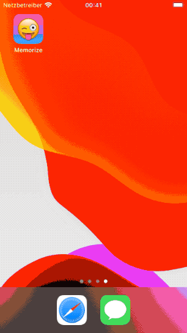

#  Memorize

A small game written using SwiftUI, based on the [Stanford University's course CS193p](https://cs193p.sites.stanford.edu) (Developing Applications for iOS using SwiftUI) of Spring 2020.

Currently (Spring 2021) a reimplementation based on the latest course (SwiftUI, iOS 14) is ongoing and can be found on the [`main-2021-spring` branch](../../tree/main-2021-spring).

